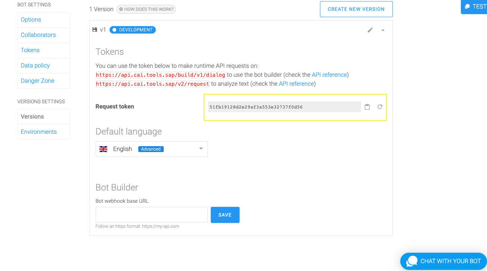
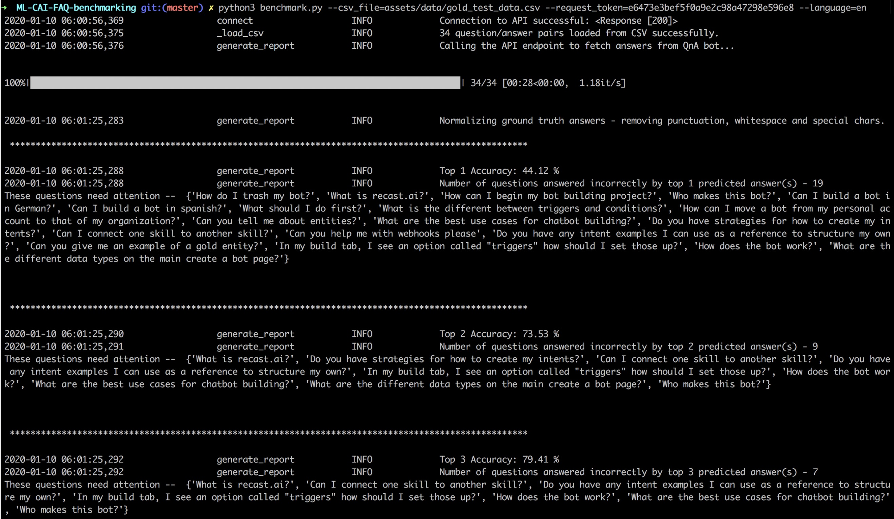

# Sample Code to Benchmark Performance of FAQ bots

## Description

### Documentation for using the /ask Endpoint for FAQ Training Analytics

The purpose of this repository is to provide sample code to analyze the performance of FAQ bots using [SAP Conversational AI](https://cai.tools.sap). This is achieved by taking questions from logs or on gold datasets prepared with the purpose of tracking the bot's performance over time. With the steps listed below, a report with metrics that demonstrates how the content performs and gaps to be fixed can be generated.

### Metrics

* `Top 1 Accuracy` - % of questions in the test data answered correctly by the top answer generated by the FAQ bot.
* `Top 2 Accuracy` - % of questions in the test data answered correctly by one of the top 2 answers generated by the FAQ bot.
* `Top 3 Accuracy` - % of questions in the test data answered correctly by one of the top 3 answers generated by the FAQ bot.

At each accuracy level (top 1, 2, 3) the report also shows the questions that were not answered correctly at the corresponding level.

## Requirements

### SAP Conversational AI Account

In order to use this report, you need a user account and FAQ bot on [SAP Conversational AI](https://cai.tools.sap).

### Software Requirements

In order to use this report, you need [Python 3](https://www.python.org/downloads/) including the [pip3](https://pip.pypa.io/en/stable/) package manager installed.

### Gold Dataset Format

The `benchmark.py` script is written in python3 and needs the gold dataset to be a CSV file with 2 columns, namely, **question** and **answer**. Each row of the CSV should contain the question and the corresponding expected answer that the bot should respond with in the best case. Also, note that the answers in the gold dataset need to be exactly the same word for word as from the FAQ.   This is required so that we can generate meaningful metrics as listed below. Please refer to the `gold_test_data.csv` file in the `assets/data` directory in the repository for a sample gold dataset for a FAQ bot set up with the corresponding question and answers from the `bot_faq_data.csv` file.

## Download and Installation

1. Clone or download the repository
2. Install dependencies by running `pip3 install -r requirements.txt` in the console
3. Authentication - Copy the `Request Token` found in the **Bot settings > versions** (you will need to expand the version to see the token)

4. Prepare a golden dataset
   - Questions should not exist in your bots dataset
   - Expected answers in the golden dataset must be exact word for word matches to those defined in the bot
5. Run the `benchmark.py` file with the arguments `--csv_file` (The location of the CSV file stored with [question, answer]), `--request_token` and `--language`

```
python3 benchmark.py --csv_file=assets/data/gold_test_data.csv --request_token=e6473e3bef5f0a9e2c98a47298e596e8 --language=en
```



## Known Issues

There are no known issues at the time of this writing.

## How to Obtain Support

This project is provided "as-is" with no expected changes or support.

## License

Copyright (c) 2020 SAP SE or an SAP affiliate company. All rights reserved.
This file is licensed under the SAP Sample Code License except as noted otherwise in the [LICENSE](./LICENSE) file.
